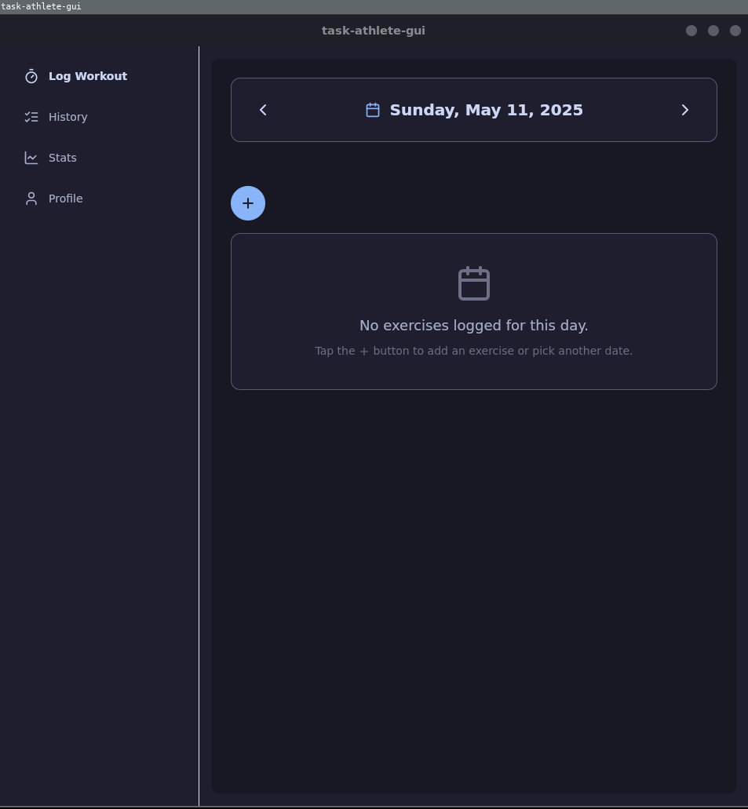
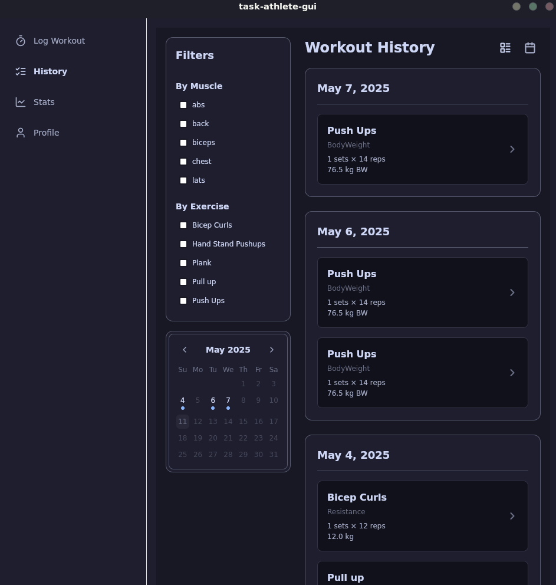
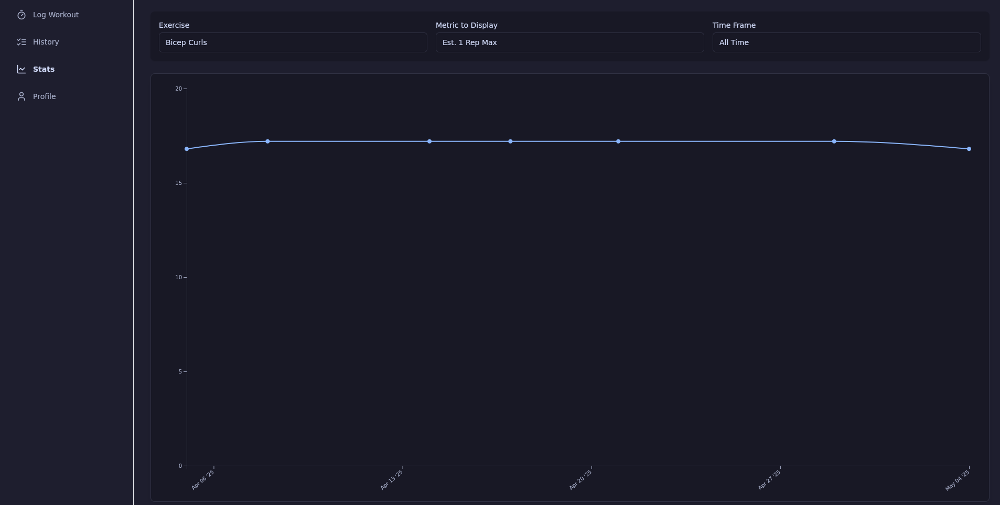
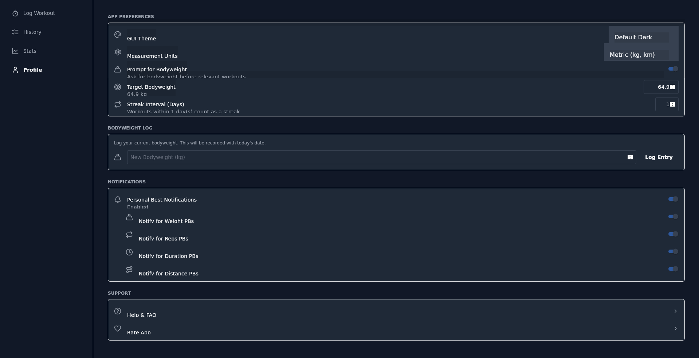

# Task Athlete GUI

The Task Athlete GUI is a modern, cross-platform desktop application for tracking your workouts, built with [Preact](https://preactjs.com/) for the frontend and [Tauri](https://tauri.app/) for the backend and window management. It leverages the core functionalities provided by the [`task-athlete-lib`](<link-to-your-lib-readme-or-repo-section>).



## Table of Contents

- [Features](#features)
- [Technology Stack](#technology-stack)
- [Project Structure](#project-structure)
- [Getting Started](#getting-started)
  - [Prerequisites](#prerequisites)
  - [Installation & Running](#installation--running)
  - [Building for Production](#building-for-production)
- [Frontend (UI)](#frontend-ui)
  - [Pages](#pages)
  - [Components](#components)
  - [Styling & Theming](#styling--theming)
- [Backend (Tauri Core)](#backend-tauri-core)
  - [Commands](#commands)
  - [State Management](#state-management)
- [Configuration](#configuration)
- [Contributing](#contributing)
- [License](#license)

## Features

*   **Modern User Interface:** A clean and intuitive graphical interface for easy workout logging and management.
*   **Cross-Platform:** Runs on Windows, macOS, and Linux thanks to Tauri.
*   **Comprehensive Workout Logging:** Add, edit, and view workouts with detailed metrics (sets, reps, weight, duration, distance).
*   **Exercise Management:** Define and manage custom exercises.
*   **Workout History:** Browse and filter your complete workout history.
*   **Visual Statistics:** View progress charts and statistics for your exercises.
*   **Profile & Settings:** Manage user preferences, including measurement units, bodyweight, and application theme.
*   **Theming:** Supports multiple themes including Default Light/Dark and Catppuccin Latte/Mocha.
*   **Responsive Design:** Adapts to different window sizes with a sidebar for larger screens and bottom navigation for smaller/mobile views.
*   **Offline First:** Data is stored locally, ensuring functionality even without an internet connection.(can be synced through a cloud provider like NextCloud or GoogleDrive)

## Technology Stack

*   **Frontend:**
    *   [Preact](https://preactjs.com/): Fast 3kB alternative to React with the same modern API.
    *   [Tailwind CSS](https://tailwindcss.com/): Utility-first CSS framework for rapid UI development.
    *   [preact-iso](https://github.com/preactjs/preact-iso): Router for Preact.
    *   [Lucide Icons](https://lucide.dev/): Beautiful and consistent open-source icons.
    *   [preact-material-components](https://material.io/develop/web/integrations/preact): UI components (Switch, Select).
*   **Backend & Desktop Framework:**
    *   [Tauri](https://tauri.app/): Build smaller, faster, and more secure desktop applications with a web frontend.
    *   [Rust](https://www.rust-lang.org/): Powers the Tauri backend and the core `task-athlete-lib`.
*   **Core Logic:**
    *   [`task-athlete-lib`](https://github.com/Vilhelm-Ian/TaskAthlete): The shared Rust library containing all business logic and data management.

## Project Structure

The GUI project typically consists of two main parts:

1.  **`src/` (Frontend - Preact):**
    *   `App.tsx`/`App.jsx`: Main application component, router setup.
    *   `main.tsx`/`main.jsx`: Entry point for the Preact application.
    *   `App.css`: Global styles, Tailwind CSS imports, and theme definitions.
    *   `components/`: Reusable UI components (e.g., `AddExerciseModal.jsx`, `DatePicker.jsx`, navigation).
    *   `pages/`: Top-level page components (e.g., `LogWorkout.jsx`, `History.jsx`, `Stats.tsx`, `Profile.jsx`).
    *   `preact.config.js`: Preact CLI configuration (e.g., for adding PostCSS plugins like Tailwind).
    *   `tailwind.config.js`: Tailwind CSS configuration.
2.  **`src-tauri/` (Backend - Rust & Tauri):**
    *   `Cargo.toml`: Rust project dependencies, including `task-athlete-lib`.
    *   `tauri.conf.json`: Tauri application configuration.
    *   `build.rs`: Tauri build script.
    *   `src/main.rs`: Main Rust entry point for the Tauri application, sets up the `AppService` and Tauri commands.
    *   `src/lib.rs`: (If present, might be a bridge or additional Tauri-specific Rust logic).

## Getting Started

### Prerequisites

*   [Node.js and npm/yarn/pnpm](https://nodejs.org/) for managing frontend dependencies.
*   [Rust and Cargo](https://www.rust-lang.org/tools/install) for building the Tauri backend and `task-athlete-lib`.
*   Tauri development prerequisites: Follow the [Tauri setup guide](https://tauri.app/v1/guides/getting-started/prerequisites) for your operating system.

### Installation & Running

1.  **Clone the repository:**
    ```bash
    git clone <link-to-your-gui-repository>
    cd <repository-directory>
    ```
2.  **Install frontend dependencies:**
    ```bash
    npm install
    # or yarn install or pnpm install
    ```
3.  **Run in development mode:**
    This command will start the Preact development server and the Tauri application.
    ```bash
    npm run tauri dev
    # or yarn tauri dev or pnpm tauri dev
    ```

### Building for Production

To build a distributable application:

```bash
npm run tauri build
# or yarn tauri build or pnpm tauri build
```
This will produce an executable/installer in `src-tauri/target/release/bundle/`.

## Frontend (UI)

The user interface is built with Preact and styled with Tailwind CSS.

### Pages

*   **Log Workout (`LogWorkout.jsx`):**
    *   Allows users to select a date and log exercises for that day.
    *   Displays existing workouts for the selected date.
    *   Provides modals for adding new exercises or sets.
*   **History (`History.jsx`):**
    *   Displays a filterable list or calendar view of all past workouts.
    *   Allows users to drill down into specific workout details.
    
*   **Stats (`Stats.tsx`):**
    *   Visualizes exercise progress with charts (using D3.js).
    *   Displays key statistics for selected exercises.
    
*   **Profile (`Profile.jsx`):**
    *   Allows users to manage application settings like GUI theme, measurement units, bodyweight, and notification preferences.
    

### Components

*   **`MainLayout.jsx`**: Provides the overall structure with sidebar/bottom navigation.
*   **`SidebarNav.jsx` / `BottomNav.jsx`**: Navigation components for different screen sizes.
*   **`AddExerciseModal.jsx`**: Modal for logging new workouts or adding sets to existing exercises. Includes `ExerciseSelectionStep.jsx` and `LogDetailsStep.jsx`.
*   **`CreateExerciseModal.jsx`**: Modal for defining new exercise types.
*   **`DatePicker.jsx`**: A custom calendar component for selecting dates.
*   **`D3ChartComponent.tsx`**: (In `Stats.tsx`) Renders charts using D3.js.
*   Other UI elements like buttons, input fields, and cards.

### Styling & Theming

*   **Tailwind CSS:** Used for utility-first styling. Configuration is in `tailwind.config.js`.
*   **CSS Custom Properties (Variables):** Defined in `src/App.css` for theming. This allows for dynamic theme switching.
*   **Themes:**
    *   Default Light
    *   Default Dark
    *   Catppuccin Latte
    *   Catppuccin Mocha
    *   Themes are applied by adding a class (e.g., `theme-catppuccin-mocha`) to the `<html>` element. Theme selection is managed in the Profile page and stored in `localStorage`.
*   **Material Design Components (MDC):** Some Preact Material Components are used (Switch, Select) and their styles are overridden using CSS variables for consistency with the selected theme.

## Backend (Tauri Core)

The Tauri backend is written in Rust and communicates with the frontend via an IPC bridge.

### Commands

Defined in `src-tauri/src/main.rs`, these Rust functions are callable from the Preact frontend using `invoke` from `@tauri-apps/api/core`. They interact with the `AppService` from `task-athlete-lib`.

Key commands include:
*   `get_config`, `save_config`
*   `set_units`, `set_bodyweight`, `set_target_bodyweight`
*   `add_workout`, `edit_workout`, `delete_workouts`, `list_workouts`
*   `create_exercise`, `edit_exercise`, `delete_exercise`, `list_exercises`
*   `get_exercise_stats`, `get_data_for_graph`
*   `list_aliases`, `create_alias`, `delete_alias`
*   `add_bodyweight_entry`, `get_body_weights`
*   And various setters for notification and streak preferences.

### State Management

*   An instance of `AppService` from `task-athlete-lib` is initialized when the Tauri app starts.
*   This `AppService` instance is wrapped in an `Arc<Mutex<AppService>>` and managed by Tauri as shared state, accessible to all backend commands.

## Configuration

The GUI application uses the same configuration system as the CLI and TUI, managed by `task-athlete-lib`.
*   **Data Location:** `~/.local/share/workout-tracker-cli/workouts.sqlite` (Linux example)
*   **Config File:** `~/.config/workout-tracker-cli/config.toml` (Linux example)
*   Settings like units, bodyweight, etc., are modified via the Profile page in the GUI, which calls backend commands that update the `config.toml` file.

## Contributing

Contributions to the Task Athlete GUI are welcome!
(Standard contribution guidelines: fork, branch, commit, PR. Mention if there are specific areas of focus or frontend/backend contribution guidelines.)

See also:
*   [`task-athlete-lib` Contribution Guide](https://github.com/Vilhelm-Ian/TaskAthlete#contributing)
*   [`ta` (CLI) Contribution Guide](https://github.com/Vilhelm-Ian/TaskAthleteCLI#contributing)
*   [`ta-tui` (TUI) Contribution Guide](https://github.com/Vilhelm-Ian/TaskAthleteTUI#contributing)

## License

This project is licensed under the [MIT License](LICENSE).
